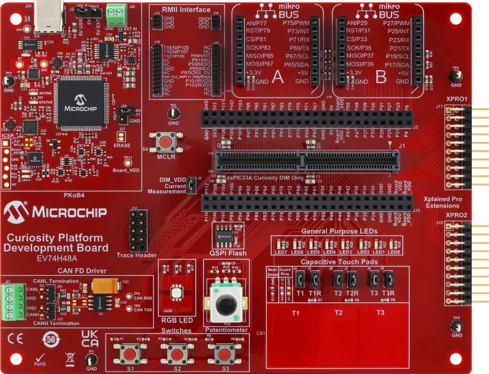

<picture>
    <source media="(prefers-color-scheme: dark)" srcset="images/microchip_logo_white_red.png">
	<source media="(prefers-color-scheme: light)" srcset="images/microchip_logo_black_red.png">
    
</picture>

## dspic33a curiosity modbus demo

## Summary

This is a basic Modbus demo to show use of the nanomodbus library (https://github.com/debevv/nanoMODBUS). 

## Related Documentation

[dsPIC33AK128MC106 datasheet](https://www.microchip.com/en-us/product/dspic33ak128mc106) for more information or specifications

## Software Used 

- [MPLAB® X IDE v6.20](https://www.microchip.com/mplabx) or newer
- [MPLAB® XC16 v3.20](https://www.microchip.com/xcdsc) or newer
- Device Family Pack: dsPIC33AK-MC_DFP v1.1.109
- [MPLAB® Code Configurator (MCC) 5.1.2](https://www.microchip.com/mcc) or newer

## Hardware Used

- [dsPIC33AK Curiosity Board](https://www.microchip.com/en-us/development-tool/EV74H48A)
- [dsPIC33AK128MC106 DIM](https://www.microchip.com/en-us/development-tool/ev02g02a)

## Setup

**Hardware Setup**

- Connect a micro-USB cable to port `J24` of Curiosity board to USB port of PC

**MPLAB® X IDE Setup**

- Open the `modbus-basic.X` project in MPLAB® X IDE
- Build and program the device

**helper script**

- To test the Modbus communication, run the helper script:  python utilities/modbus_tester.py

## Operation

The modbus_basic.X project was written for the dsPIC33AK128MC106 device running on the dsPIC33A Curiosity Platform Board P/N EV74H48A. 
The application creates a Modbus RTU server. Custom user callback functions for nanomodbus are created in the modbus.c file. 
The number of coils and registers used in the application are defined in modbus.h. Data transfer is done over the UART to USB 
interface of the Curiosity Platform Board. The Python script in the project directory uses the pymodbus library to create a basic 
client to write and then read some registers and coils.

## MCC settings for reference

**Clock Configuration**

- Clock Configuration is done in MCC Melody User Interface for this demo code  
  

**UART Configuration**

- UART Configuration is done in MCC Melody User Interface for this demo code  
  

**Timer Configuration**

- Timer Configuration is done in MCC Melody User Interface for this demo code  
  

**PIN Configuration**

- UART Pins: RD1 as U1TX and RD3 as U1RX 
  

